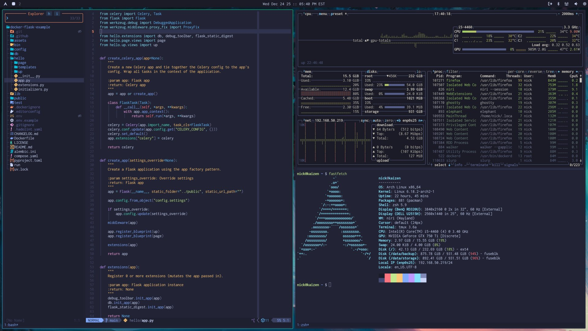

# dotfiles

This readme along with an install script will help you get everything running
in a few minutes. It contains a bunch of configuration for the [tools I
use](https://nickjanetakis.com/blog/the-tools-i-use). I also have a number of
[blog posts and
videos](https://nickjanetakis.com/blog/tag/dev-environment-tips-tricks-and-tutorials)
related to my dev environment.

## 🧬 Who Is This For?

This project is more than a few config files. **In 1 command and ~5 minutes it
can take a new or existing system and install / configure a number of tools
aimed at developers**. It will prompt or warn you if it's doing a destructive
action like overwriting a config file. You can run the idempotent [install
script](./install) multiple times to stay up to date.

### Philosophy

I deeply understand one person's bloat is another person's treasure. All
packages, configs and symlinks are configurable before you modify your system.
A mini-goal of this project is to avoid needing to fork this project while
still giving you a reasonable amount of control, and if you want to fork it
that's fine too.

Your machine is yours. If you want to dual boot, do it up. If you want multiple
users, sure thing. If you don't want to encrypt your drive, no problem.
Everyone is welcome here and you have full control.

## 🎁 What's in the Box?

### Command Line

*Supports Arch Linux, Debian, Ubuntu and macOS. It also supports WSL 2 for any
supported Linux distro.*

- Highlights:
  - Tweak out your shell (zsh)
  - Set up tmux
  - Fully configure Neovim
  - Create SSH / GPG keys if they don't already exist
  - Install modern CLI tools and programming languages

### (Optional) Scrolling / Tiling Desktop Environment

*Supports Arch Linux.*

- Highlights:
  - [niri](https://github.com/YaLTeR/niri) *(Wayland compositor)*, Waybar *(status bar)*, Walker *(app launcher)* and friends
  - Hotkey focused but tons of mouse / trackpad support
  - Prefer TUI (Terminal User Interface) apps over GUI apps when possible
  - Development / media creation focused apps are ready to go

#### Why niri and not XYZ?

It's resource efficient, lightning fast, super stable, infinitely tweakable,
intuitively handles scrolling / tiling / floating windows, integrates awesomely
with multiple monitors, actively developed, well thought out, has great
documentation and the author is very helpful.

niri feels like a perfect match and I wanted to make a special call out because
it's *that* good. I'm the "I was there 3,000 years ago" meme from Windows 2000,
XP, 7, 10 and also macOS on company issued laptops. Nothing I have ever used in
~25 years has approached how I feel using this set up. It's not even close (yes
I tried Hyprland too).

### Full Package List

There's docs with a [complete list of packages](./docs/packages.md) along with
what they're being used for and why.

The source of truth can always be found near the top of the [install
script](./install). If you scroll down a little bit you'll see variables for
each package manager. You can search for `PACKAGES_PACMAN` and go from there.

## 🧾 Documentation

- [Themes](#-themes)
- [Quickly Get Set Up](#-quickly-get-set-up)
- [FAQ](#-faq)
  - [How to personalize these dotfiles?](#how-to-personalize-these-dotfiles)
  - [How to theme custom apps?](#how-to-get-theme-custom-apps)
  - [How to add custom themes?](#how-to-add-custom-themes)
  - [How to install Arch Linux?](#how-to-install-arch-linux)
  - [How do I get started with the desktop environment?](#how-do-i-get-started-with-the-desktop-environment)
  - [Where is the original Vim config?](#where-is-the-original-vim-config)
- [About the Author](#-about-the-author)

## 🎨 Themes

Since these dotfiles are constantly evolving and I tend to reference them in
videos, blog posts and other places I thought it would be a good idea to
include screenshots in 1 spot.

### Tokyonight Moon



### Gruvbox Dark (Medium)


I prefer using themes that have good contrast ratios and are clear to see in
video recordings. These dotfiles currently support easily switching between
both themes but you can use any theme you'd like.

If you want to see icons you'll need a "nerd font". There's hundreds of them on
<https://www.nerdfonts.com/font-downloads> with previews. I personally use
Inconsolata NF which these dotfiles install for you.

### Setting a theme

These dotfiles include a `dot-theme-set` script that you can run from your
terminal to set your theme to any of the themes listed above.

You can look in the [themes/](./themes/) directory to see which apps are themed
and [add additional apps](#how-to-theme-custom-apps) too.

If you don't like the included themes that's no problem. You can [add custom
themes](#how-to-add-custom-themes) and remove the defaults.

After installing these dotfiles you can switch themes with:

```sh
# Get a full list of themes by running: dot-theme-set --list
#
# Optionally you can skip adding a theme name and a random theme will be chosen.
dot-theme-set THEME_NAME
```

When switching themes most terminal apps will update automatically, but if you
have a bunch of shells already open you can run the `SZ` ([source
zsh](https://nickjanetakis.com/blog/running-commands-in-all-tmux-sessions-windows-and-panes))
alias to source new theme related configs.

*Not all terminals are supported, if yours didn't change then check [theming
custom apps](#how-to-theme-custom-apps).*

### Wallpapers

*Only available when the desktop environment is set up.*

You can cycle between wallpapers that are compatible with the active theme.
This is controlled through the `_theme.json` file in each theme's directory,
it's under the `wallpaper.synergy` object.

```sh
# Set the next wallpaper.
dot-theme-set-bg
```

## ✨ Quickly Get Set Up

There's an `./install` script you can run to automate installing everything.
That includes installing system packages such as zsh, tmux, Neovim, etc. and
configuring a number of tools in your home directory.

It even handles cloning down this repo. You'll get a chance to pick the clone
location when running the script as well as view and / or change any system
packages that get installed before your system is modified.

If you're setting up a brand new system and plan to use the desktop environment
you'll want to set up a bootable USB stick with the official [Arch Linux
ISO](https://fastly.mirror.pkgbuild.com/iso/latest/) and then run the official
[archinstall](https://wiki.archlinux.org/title/Archinstall) script. There is a
FAQ item [covering all of that](#how-to-install-arch-linux).

### 🌱 On a fresh system?

We're in a catch-22 where this install script will set everything up for you
but to download and run the script to completion a few things need to exist on
your system first.

**It comes down to needing these packages, you can skip this step if you have
them**:

- `curl` to download the install script
- `bash 4+` since the install script uses modern Bash features
  - This is only related to macOS, all supported Linux distros are good to go out of the box

Here's 1 liners you can copy / paste once to meet the above requirements on all
supported platforms:

#### Debian / Ubuntu

```sh
# You can run this as root.
apt-get update && apt-get install -y curl
```

#### macOS

If you run `bash --version` and it says you're using Bash 3.X please follow
the instructions below:

```sh
# Curl is installed by default but bash needs to be upgraded, we can do that
# by brew installing bash. Once this command completes you can run the install
# script in the same terminal where you ran this command. Before running the
# install script `bash --version` should return a version > 3.X.

# OPTION 1: Using Apple silicon?
/bin/bash -c "$(curl -fsSL https://raw.githubusercontent.com/Homebrew/install/HEAD/install.sh)" \
  && eval "$(/opt/homebrew/bin/brew shellenv)" \
  && brew install bash \
  && bash

# OPTION 2: Using an Intel CPU?
/bin/bash -c "$(curl -fsSL https://raw.githubusercontent.com/Homebrew/install/HEAD/install.sh)" \
  && eval "$(/usr/local/bin/brew shellenv)" \
  && brew install bash \
  && bash

# The colors will look bad with the default macOS Terminal app. These dotfiles install: https://ghostty.org/
```

### ⚡️ Install script

**You can download and run the install script with this 1 liner:**

```sh
BOOTSTRAP=1 bash <(curl -fsSL https://raw.githubusercontent.com/nickjj/dotfiles/master/install)
```

The above command only downloads a few files into a temporary directory and
then provides a little bit of help text on how to proceed with the
installation. Think of it as a pre-installer.

*If you're not comfortable blindly running a script on the internet, that's no
problem. You can view the [install script](./install) to see exactly what it
does. The bottom of the file is a good place to start. Alternatively you can
look around this repo and reference the config files directly without using any
script.*

🐳 **Try it in Docker without modifying your system:**

```sh
# Start a Debian container, we're passing IN_CONTAINER to be explicit we're in Docker.
docker container run --rm -it -e "IN_CONTAINER=1" -v "${PWD}:/app" -w /app debian:stable-slim bash

# Copy / paste all 3 lines into the container's prompt and run it.
#
# Since we can't open a new terminal in a container we'll need to manually
# launch zsh and source a few files. That's what the last line is doing.
apt-get update && apt-get install -y curl \
  && bash <(curl -sS https://raw.githubusercontent.com/nickjj/dotfiles/master/install) \
  && zsh -c ". ~/.config/zsh/.zprofile && . ~/.config/zsh/.zshrc; zsh -i"
```

*Keep in mind with the Docker set up, unless your terminal is already
configured to use Tokyonight Moon then the colors may look off. That's because
your local terminal's config will not get automatically updated.*

**🚀 Keeping things up to date and tinkering**

Once you've installed these dotfiles you can run `cd "${DOTFILES_PATH}"` to
manage them.

Here's a few handy commands, you can run `./install --help` to see all of them:

- `./install`
  - Run the install script based on the local copy of your dotfiles
  - Keeps your system up to date or apply local changes
- `./install --skip-system-packages | -S`
  - Run the install script like above but skip installing or updating packages
  - Helps regenerate symlinks, configs and everything else without modifying packages
- `./install --pull | -p`
  - Pulls in the latest remote commits but doesn't run the install script
  - Lets you review any changes locally before the install script runs
- `./install --update | -u`
  - Pulls in the latest remote commits and runs the install script
  - Shortcut to pull and run the install script together
- `./install --diff-config | -g`
  - Compare your local `install-config` to the local `install-config.example`
  - Helps keep your git ignored `install-config` in sync with new options
- `./install --diff | -d`
  - Compare what you have locally vs the latest remote commits
  - See what will change if you `--update` without modifying your git tree
- `./install --new-commits | -n`
  - Show new remote commits that do not exist locally
  - Present a quick list of what's available to pull locally
- `./install --changelog | -c`
  - Show all remote commits
  - Present a quick list of all commits to see what has changed
- `./install --local-files | -l`
  - Show all local git ignored files such as configs, history and scripts
  - Useful to see everything not committed and for optionally backing up those files
    - Example: `./install --local-files | xargs zip dotfiles-personal.zip`

*There's also a `LOCAL=1` environment variable you can set when bootstrapping
or running the other install commands. This is handy for doing local tests
in containers without needing to commit, push and pull changes.*

### 🛠 Make it your own

If you just ran the install script and haven't done so already please close
your terminal and open a new one. If you've set up GUI mode with Arch Linux
you'll want to reboot too.

There's a few ways to customize these dotfiles ranging from forking this repo
to customizing [install-config](./install-config.example) which is git ignored.
The second option lets you adjust which packages and programming languages get
installed as well as configure a number of other things without forking this
project.

Before you start customizing other files, please take a look at the
[personalization question in the FAQ](#how-to-personalize-these-dotfiles).

### 🪟 Extra WSL 2 steps

In addition to the Linux side of things, there's a few config files that I have
in various directories of this dotfiles repo. These have long Windows paths and
are in the `mnt/c/` directory.

It would be expected that you copy those over to your system while replacing
"Nick" with your Windows user name if you want to use those things. The
Microsoft Terminal config will automatically be copied over to your user's
path.

It's expected you're running WSL 2 with WSLg support to get clipboard sharing
to work between Windows and WSL 2. You can run `wsl.exe --version` from WSL 2
to check if WSLg is listed. Chances are you have it since it has been supported
since 2022! All of this should "just work". If clipboard sharing isn't working,
check your `.wslconfig` file in your Windows user's directory and make sure
`guiApplications=false` isn't set.

*If you see `^M` characters when pasting into Neovim, that's a Windows line
ending. That's because WSLg's clipboard feature doesn't seem to handle this
automatically. If you paste with `CTRL+SHIFT+v` instead of `p` it'll be ok. I
guess the Microsoft Terminal does extra processing to fix it for you.*

Pay very close attention to the `mnt/c/Users/Nick/.wslconfig` file because it
has values in there that you will very likely want to change before using it.
[This commit
message](https://github.com/nickjj/dotfiles/commit/d0f1fc2622204b809cf7fcbb1a82d45b451064c4)
goes into the details.

Also, you should reboot or from PowerShell run `wsl --shutdown` and then
re-open your WSL instance to activate your `/etc/wsl.conf` file (the install
script created this).

You may have noticed I don't enable systemd within WSL 2. That is on purpose.
I've found it delays opening WSL 2 by ~10-15 seconds and also any systemd
services were delayed from starting by ~2 minutes.

## 🔍 FAQ

### How to personalize these dotfiles?

The [install-config](./install-config.example) lets you customize a few things
but chances are you'll want to personalize more than what's there, such as
various Neovim settings. Since this is a git repo you can always do a
`./install --pull` or `git pull` to get the most up to date copy of these
dotfiles, but then you may find yourself clobbering over your own personal
changes.

We have a few reasonable options without custom branches or forking:

- For minor changes like adjusting which packages get installed, the install config file lets you do that
- For minor config changes some tools let you include config files, so any git ignored `.local` files you see is a way to customize them without needing to adjust the main config
- For major config changes can configure the `CONFIG_INSTALL` commands
to symlink other files and directories that are git ignored, this lets you keep
your "real" files in the dotfiles repo with a different name

If the above isn't enough, or maybe you want things more streamlined you can
`git checkout -b personalized` and now you're free to make whatever changes you
want on your custom  branch. When it comes time to pull down future updates you
can run a `git pull origin master` and then `git rebase master` to integrate
any updates.

Another option is to fork this repo and use that, then periodically pull and
merge updates. It's really up to you. By default these dotfiles will add an
`upstream` git remote that points to this repo for easy comparison.

I personally use these dotfiles on 3 different devices with different operating
systems and haven't forked or created separate branches on any of them. I just
tweaked the install config.

### How to theme custom apps?

You'd add its theme file to each theme in [themes/](./themes) and update the
[install](./install) script's `set_theme` function to symlink the config. If
your app has no dedicated config file, you can copy what I did for the
Microsoft Terminal in `set_theme`.

Happy to assist in your issue / PR to answer questions if you want to
contribute your change.

### How to add custom themes?

1. Locate the [themes/](./themes) directory in this repo
2. Copy one of the existing themes' directory
3. Rename your directory, this will be your theme's name
4. Adjust all of the colors as you see fit

Switch to it by running `dot-theme-set NEW_THEME_NAME` and use the name you
picked in step 3.

If you added a theme with good contrast ratios please open a pull request to
get it added to this project.

### How to install Arch Linux?

Nothing here is too specific to these dotfiles, it's general knowledge on
setting up Arch but I wanted to include these steps to help get you going.

#### Set up a bootable USB drive

- Obtain a USB drive (a few gigs is fine)
- Download the [official Arch ISO](https://fastly.mirror.pkgbuild.com/iso/latest/)
  - You'll likely get the `archlinux-YYYY-MM-DD-x86_64.iso` file, it's about ~1.5 GB
- Create a bootable USB drive using the above ISO
  - The tool you use depends on your OS, but likely choose UEFI / GPT options if asked
- Insert the USB drive and reboot
- Configure your BIOS to boot into the USB drive first

#### After booting from the USB drive

- Following any instructions it says before running `archinstall`
  - For example if you use Wi-Fi you'll want to run `iwctl` to [set up your network](https://wiki.archlinux.org/title/Iwd#iwctl):
    - `iwctl`
      - `device list` shows devices such as `wlan0` which we'll use below
      - `station wlan0 scan` searches for networks (no output is normal)
      - `station wlan0 get-networks` lists your Wi-Fi networks
      - `station wlan0 connect <NETWORK_NAME>` prompts you for your password
      - `exit` brings you back to your shell
      - You should be connected to the internet at this point
        - Verify with `ping example.com` and hit CTRL+c to stop

#### Run `archinstall` from your shell

The script guides you pretty well. Here's a few important callouts in the order
they appear in the menu. The callouts are mostly my opinions, you can of course
choose other options and have things work. The goal of this guide isn't to
dictate what you do, it's to help you avoid analysis paralysis and see what's
configurable before you do it.

*Nothing you choose will happen immediately, you'll get to review everything at
the end before anything happens. Generally speaking you'll be using enter to
select options, escape to go back, the arrow keys to change selections and
space to toggle checkboxes.*

- **Archinstall language**:
  - Pick what makes sense for your location
- **Mirrors**:
  - Pick a region close to where your live
- **Locales**:
  - Pick what makes sense to you
- **Disk configuration**:
  - If you go with the default "best effort" it will wipe your full drive:
    - This is reasonable if you're *not* dual booting, if you dual boot you'll want to manually set this up
    - Make sure the correct drive you want wiped is selected!
    - For the file system type, I went with `ext4` given how mature it is but `btrfs` is also mostly ok, if you're not sure or don't know what's different just choose `ext4`
    - Now it asks if you want a separate partition for your home directory, I chose no because I always end up wanting to adjust the size later and prefer skipping LVM but it's up to you of course
    - Review the info, you should see `/boot` and `/` (root) partitions at the very least
- **Disk encryption**:
    - It's up to you, I would, choose to encrypt all of your non-boot partitions and set a good password, then double confirm you can remember this password, it's very important
- **Swap**:
  - It's up to you, I kept it enabled with zram which was the default
- **Bootloader**:
  - I rolled with `systemd-boot` which is the default
- **Unified kernel images**:
  - I left this turned off but I suggest reading up on this more if you're interested
- **Hostname**:
  - Picking a cool name will probably be the [longest time](https://xkcd.com/910/) you spend in the installer
  - You can always change it afterwards, don't sweat it!
- **Root password**:
  - Definitely set a password and don't forget it
- **User account**:
  - Create your main user and pick a password you won't forget
  - Allow this user to be a superuser (sudo) as well
  - You'll be logging in as this user, you can create more users later if needed
- **Profile**:
  - You can skip this (leave it unselected)
  - These dotfiles handle setting up your desktop environment (including GPU drivers)
- **Audio**:
  - You can skip this (choose no audio server)
  - These dotfiles will set up `pipewire` and its related packages
- **Kernels**:
  - The normal kernel is likely fine which is the default but feel free to choose otherwise
- **Network configuration**:
  - Go with "Copy ISO network configuration" unless you have other opinions
  - This just means it will use whatever you used in this bootable USB environment
- **Additional packages**:
  - I suggest installing `neovim` to maybe edit the dotfiles `install-config` before you run it
    - This isn't extra bloat since these dotfiles install `neovim` by default
- **Optional repositories**:
  - You can skip this unless you have reasons otherwise
- **Timezone**:
  - Pick what makes sense for your location
- **Automatic time sync (NTP)**:
  - Yep, turn this on, it will use `systemd-timesyncd` for this

At this point you can write this configuration to the USB drive for next time
(not necessary), install or abort. Choose install which will then show you a
load out of what's going to happen.

Before hitting enter to continue, you can use page up / down to see what's
going to happen. Triple check your drive being formatted is the correct one
and everything else looks good!

- Sit back and relax while everything gets installed for ~5-10 minutes
- Choose "no" when it prompts you to chroot into the installation
- Remove the USB drive from your computer
- Run `reboot`
- Configure your BIOS to boot from the drive you just installed Arch on

#### Booting up

Depending on what boot loader you used, you can pick Arch Linux to boot into.

If everything worked properly, you'll get booted into a `tty1` black login
screen. You can log in with the user and password you created. If you enabled
drive encryption you'll get prompted for your decrypt password before logging
in.

At this point you have Arch installed and you can run the install script
earlier in this readme to bootstrap your box!

### How do I get started with the desktop environment?

After logging in you'll be greeted with an empty desktop and a top bar.

- A few key binds:
  - `Mod + Alt + T  ::  Terminal`
  - `Mod + Alt + B  ::  Browser`
  - `Mod + Alt + /  ::  Show Important Hotkeys`
- Connect to Wi-Fi *if needed* by clicking the Wi-Fi icon in the top right
  - Alternatively you can run `impala` from a terminal
  - If your system has no Wi-Fi adapter this tool won't be installed
- Connect Bluetooth devices *if needed* by clicking the Bluetooth icon in the top right
  - Alternatively you can run `bluetui` from a terminal
  - If your system has no Bluetooth adapter this tool won't be installed
- Verify your sound works by visiting YouTube or some site with audio
  - There's a sound icon in the top right to pick your input and output devices
  - Alternatively you can run `wiremix` from a terminal
  - Both `mpd` and [rmpc](https://github.com/mierak/rmpc) are installed for playing music, configure your music directory!
- Open a terminal and run `dt` to switch to the dotfiles repo and open it in Neovim
  - Explore `.config/niri/config.kdl` for a complete list of key binds
- Have fun with *your* new system!

### Where is the original Vim config?

I've made dozens of [blog posts and
videos](https://nickjanetakis.com/blog/tag/vim-tips-tricks-and-tutorials) about
Vim. Sometimes I linked directly to a commit so there's a permalink to it but
other times I did not.

Before switching to Neovim I made a `vim` git tag. You can check out the state
of the repo for that tag by [going
here](https://github.com/nickjj/dotfiles/tree/vim). You'll see `.vimrc` in the
root directory. If you cloned these dotfiles locally you can `git checkout
vim`. Keep in mind that's frozen to that point in time. Future updates
unrelated to Vim will not be included in that tag.

## 👀 About the Author

I'm a self taught developer and have been freelancing for the last ~20 years.
You can read about everything I've learned along the way on my site at
[https://nickjanetakis.com](https://nickjanetakis.com/). There's hundreds of
[blog posts](https://nickjanetakis.com/blog/) and a couple of [video
courses](https://nickjanetakis.com/courses/) on web development and deployment
topics. I also have a [podcast](https://runninginproduction.com) where I talk
to folks about running web apps in production.
